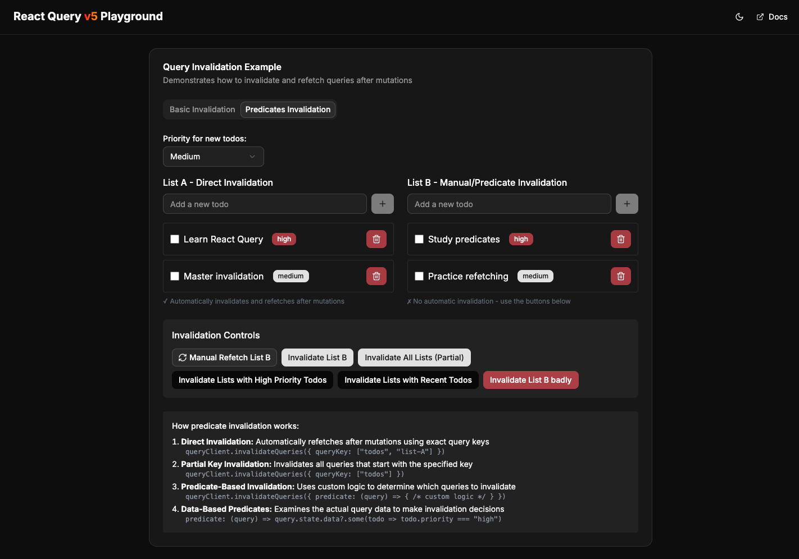

# React Query Playground

A feature-rich playground for exploring the full power of [TanStack React Query](https://tanstack.com/query/latest). This project provides hands-on examples for both beginners and advanced users to understand how React Query works in real-world scenarios.


## 🚀 Features

### Core Features

- Basic Queries
- Refetching Strategies
- Query Invalidation
- Dependent Queries
- Optimistic Updates

### Advanced Features

- Pagination
- Infinite Queries
- Prefetching
- Query Cancellation
- Suspense Mode
- WebSocket / Realtime Updates
- Testing Strategies

## 📸 Screenshot

 <!-- Add your screenshot here -->

## 🧠 Why This Exists

This playground was built to help developers deeply understand how React Query works — from caching and background fetching to advanced workflows like optimistic updates and real-time data with WebSockets.

> 💡 Use the [TanStack DevTools](https://tanstack.com/query/latest/docs/framework/react/devtools) to inspect query caches and debug query states while navigating the examples.

## 📦 Tech Stack

- [Next.js 15](https://nextjs.org/)
- [React 19](https://react.dev/)
- [Tailwind CSS 4](https://tailwindcss.com/)
- [Radix UI](https://www.radix-ui.com/)
- [Lucide Icons](https://lucide.dev/)
- [TanStack React Query v5](https://tanstack.com/query/latest)
- [React Query DevTools](https://tanstack.com/query/latest/docs/framework/react/devtools)

## 🛠️ Getting Started

1. **Clone the repo:**

```bash
git clone https://github.com/your-username/react-query-playground.git
cd react-query-playground
```

2. **Install dependencies**

```bash
pnpm install # or yarn / npm
```

3. **Run the development server:**

```bash
pnpm dev
```

4. **Explore the examples:**

Open your browser and go to http://localhost:3000 — navigate using the sidebar.

## 🖼️ Project Structure

```bash
├── app/               # Next.js routes
├── components/        # Reusable UI elements
├── hooks/             # Custom hooks using React Query
├── lib/               # Helper functions
├── public/            # Static assets (e.g., screenshot.png)
```

## 🌍 Contributing

Contributions are welcome! Feel free to open an issue or a pull request to add examples, fix bugs, or improve documentation.

```bash
git checkout -b your-feature-branch
git commit -m "feat: add new example"
git push origin your-feature-branch
```

## 📄 License

This project is licensed under the MIT License.
